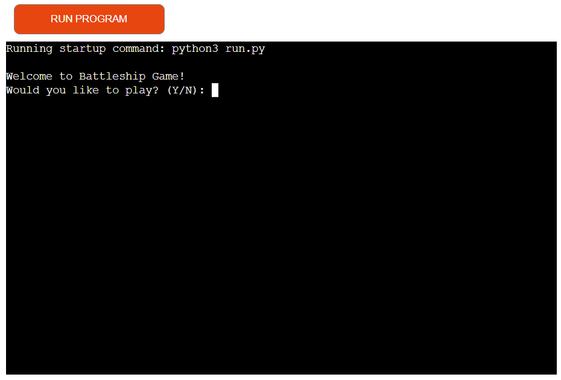

## Table of Contents
- [Project Goals](#project-goals)
    - [User Stories](#user-stories)
    - [Site Owner Goals](#site-owner-goals)
- [User Experience](#user-experience)
    - [Target Audience](#target-audience)
    - [User Requirements and Expectations](#user-requirements-and-expectations)
    - [User Manual](#user-manual)
- [User Stories](#user-stories)
    - [Users](#users)
    - [Site Owner](#site-owner)
- [Technologies Used](#technology-used)
    - [Language used](#language-used)
    -[Python Libraries used](#python-libraries-used)
    - [Other websites/tools used](#other-websitestools-used)
    - [3rd Party Python Libraries used](#3rd-party-python-libraries-used)
- [Features](#features)
    - [Existing Features](#existing-features)
    - [Features to be implemented](#features-to-be-implemented)
- [Testing](#testing)
    - [Manual Testing](#manual-testing)
    - [Tested Devices with Browsers](#tested-devices-with-browsers)
    - [Validator Testing](#validator-testing)
    - [Bugs and Fixes](#bugs-and-fixes)
- [Deployment](#deployment)
    - [Deploying in Heroku](#deploying-the-website-in-heroko)
    - [Forking the GitHub Repository](#forking-the-github-repository)
    - [Cloning of Repository in GitHub](#cloning-the-repository-in-github)
- [Credits](#credits)
    - [Content](#content)
    - [Code](#code)
- [Acknowledgements](#acknowledgements)

## Project Goals
  - The goal of this project was to create a battleships game where the player plays against the computer

### User Stories
- Play battleships
- Be able to choose if user would like to play
- Be able to see where a user has placed their battleships
- Be able to see opponents board and where the user has targeted

### Site Owner Goals
- To make a game that is easy to understand
- To ask the user if they would like to play the game
- To make sure user can place ships on valid targets
- To make sure user can only attack on valid parts of the game grid
- To give the user a choice to play again

## User Experience

### Target Audience
- No specific target audienc
- Anyone who enjoys to play battleships

### User Requirements and Expectations
- No requirements to play
- Expect to see both the player board and computer board 
- Expect to see if player move has hit the desired target
- Expect to see computer move 

### User Manual

Click here to view instructions

#### Welcome to game

- Once game is started up asks user if they would like to play
- User must enter y/n
- Any other unput prompt user to try again

#### Placing battleships
- Player starts out with 5 ships (Carrier: 5 cells, Battleship: 4 cells, Cruiser: 3 cells, Submarine: 3 cells, Destroyer: 2 cells)
- When game starts it will prompt user to enter a coordinate to place ships
- Once a player has chosen a coordinate, the prompt will ask if player would like placement to be "V" for vertical
or "H" for horizontal.
- Areas where the player battleships are place are marked with 'O'
- Computer battleships will be placed randomly and are hidden from the player

#### Player turn
- Once all player battleships have been placed, the game begins
- Player will be asked to choose a coordinate to attack (e.g A1)
- If the player enters anything other than a coordinate they will prompted to try again
- If a player misses a computer battleship they will see a message saying "Miss!"
- If a player hits a computer battleship they will see a message saying "Hit!"
- Areas where the player has missed will be marked with '-' and hits marked with 'X' on the board
- If a player chooses an already chosen coordinate they will receive a message saying 
"You already targeted this cell." and prompting a user to enter another coordinate

#### Computer turn
- Once a player has chosen a coordinate to attack the computer will also choose a coordinate
- Underneath the computer board the player will see if the computer has missed or hit a target 
- Underneath the computer move showing where the computer has hit on their board
- If a computer has missed a coordinate, it will be marked with '-'
- If a computer has hit a coordinate, it will be marked with 'X' 

#### Win or lose
- Once a player has hit all the computer battleship cells they will recieve the message 
"Congratulations! You sank all the computer's ships."
- If the computer hits all players battleship cells they will revieve the message 
"Game Over! The computer sank all your ships."

#### Restart game
- Once the game is over user is asked whether the would like to play again Y/N
- If user selects "Y" the game will reset the game
- If user selects "N" the game will exit with a goodbye message

## User Stories

### Users
- I want to be able to choose where to put my battleships
- I want to be able to see my game board and ships
- I want to be able to see the opponents board
- I want to be able to play again

### Site Owner
- I want users to be able to enter correct coordinates
- I want users to be able to see which cells have been used or hit
- I want users to know how coordinates should be entered and validated
- I want users to be able to choose if they would like to play
- I want users to choose if they would like to play again

## Technologies Used

### Languages Used
- Python

### Python Libraries used
- random 

### Websites and tools
- [GitHub](https://github.com/)
- [GitPod](https://www.gitpod.io/)
- [Heroku](https://www.heroku.com/)
- [Pycharm](https://www.jetbrains.com/pycharm/)

### 3rd Party Python Libraries used

## Features

### Welcome to battleships
- Welcome the user to the game
- Promts Y/N to start playing the game

    
Welcome to game screenshot

    

  

